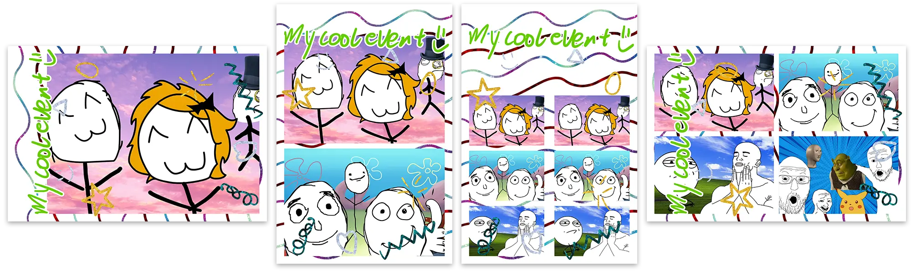

# The concept

This page will briefly explain the concept and user experience of MomentoBooth.

First of all, the central ideology behind MomentoBooth is to create a **fun experience** for everyone involved with the software. This philosophy shows itself in little things like the confetti that shows when a capture is completed, but also the control that organisers and users have over their own experience.

The interface is meant to be used with a touchscreen, though other ways of controlling the software are being considered. As any photobooth software, the main mechanic is to capture photos at the end of a countdown, present users with some themed version of that picture. Optionally this picture can be printed or downloaded.

MomentoBooth has two main capture modes: **single capture** and **multi-capture**.

## Single capture

In single capture mode, the software only takes a single photo and presents the user with the result. Whether this is just the picture or a collage with 1 picture depends on the user's project settings. The user can choose to retake a picture if the result is deemed unflattering. The system will ask whether they want to keep the old file or not.

## Multi-capture
In multi-capture mode, multiple pictures are taken that are subsequently merged in a collage image. There are two ways to go about this: have a fixed number of images for a fixed layout, or offer the users a choice after shooting images.

### Different layouts
MomentoBooth currently supports 4 different collage layouts, containing and corresponding to 1, 2, 3, or 4 pictures. The layouts are structured like this:

1. Collage is landscape; the picture also in landscape position with some margin for theme material.
2. Collage is portrait; the two pictures positioned above each other.
3. Collage is portrait; the layout with 3 pictures is the one classically used by other photobooth softwares, and will be printed as two strips in one print. These can be cut automatically by supported printers.
4. Collage is landscape; the 4 pictures are arranged in a grid.

> [!NOTE]
> Here, all the layouts use the same template files, but they can be customized *per layout*.

In the future, we want to offer more customizability in the image placement layout.

### Fixed number of captures
This is the classical modus operandi of photobooths. You hit start, the machine takes a number of pictures, and it presents the result. The organiser of the event can choose which version of the layouts they want, limiting the number of pictures taken to the number of images in the layout.

A slight difference with the classic photobooths is that MomentoBooth allows you to choose exactly how many prints you want, and one can optionally also choose the print size.

### User collage choice
In the "user chooses" mode, 4 pictures are taken. Then, the users are presented with a collage creation screen where they can choose which pictures they want to include in their collage, and in which order. They can thus opt for a result that contains 1, 2, 3, or all 4 photos that were taking, resulting in the different layouts described above.

After finishing the selection process the users can optionally print or download their collage on the share screen.

## Advanced: manual collage mode
This mode is not accessible from the normal usage flow, but can be entered from the menu or by pressing `Ctrl+M`. In the manual collage mode, the user (probably the moderator) is presented with a list of _all_ captured input images, and can create new collages from this material at will. This allows, for example, the creation of multiple collages of the same 4 captures, or the creation of collages of manually shot pictures of the event.

  

---

Now, let's move on to the getting started page to start capturing!
