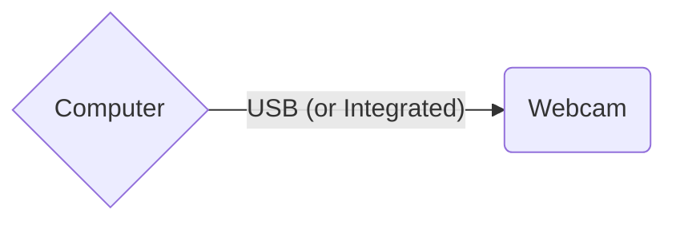
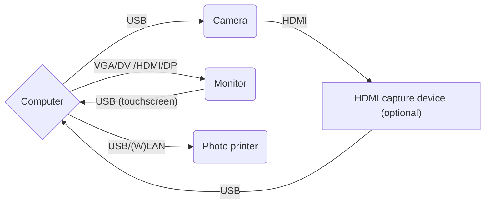
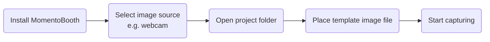

# Getting started

Getting started with MomentoBooth is easy! You only need a computer/laptop with a webcam for a minimal setup. This pages lists our hardware recommendations and minimal software set up steps.

## Minimal hardware

THe minimal setup mentioned above approximately consists of a computer that is not ancient with a webcam. You can check out specific details in the fly-out below.

A very basic (but useful for experimenting and developing) setup

- **A computer**
  - **OS** either:
    - Windows 10/11
      - Windows 7/8/8.1 might work, but untested
    - Linux
      - Ubuntu 20.04 or newer, other recent distros should also be fine
    - macOS
      - Only tested on macOS 13 (Ventura), older versions might work but untested
  - **CPU**: Intel Core i5 (2nd gen) or equivalent
    - Older might work, but untested
  - **GPU**: Integrated or dedicated graphics by Intel/AMD/NVIDIA
    - Anything > 2010 should work fine, a little older may also work
    - Software rendering might work but untested
  - **Memory**: 4 GB
  - **Disk**: HDD with at least some space left for photo storage
  - **Monitor**: Anything
- **Webcam** (optional)

## Recommended hardware

If you want to provide the full experience to the people at your event, a decent computer with touch screen, digital camera, and maybe even a printer are required. See the fly-out below for our recommendations.

Recommended setup

- **A computer**
  - **OS** either:
    - Windows 10/11
    - Linux
      - Ubuntu 20.04 or newer, other recent distros should also be fine
    - macOS 13
  - **CPU**: Intel Core i3 (6th gen) or equivalent
  - **GPU**: Integrated or dedicated graphics by Intel/AMD/NVIDIA
  - **Memory**: 8 GB
  - **Disk**: SSD with enough space left for photo storage
  - **Monitor**: At least 1920×1080 px with touch
- **Digital camera**
  - Live view: Supported directly by gPhoto2, or using HDMI out and a USB HDMI capture device (which can act like a webcam)
  - Capturing: Supported directly by gPhoto2
- Optional: **Photo printer**
- Optional: **Internet connection**

## Running the application

Getting up and running is quite simple, and the process looks mostly like this:

Below is a step by step explanation of what to do.

1. **Download/install the latest MomentoBooth release for your OS**, check the [install instructions](installation.md).
    - It may be convenient to place a shortcut on your desktop.
2. **Run MomentoBooth**.
3. You will be greeted by the **onboarding wizard** to run some checks and get some things set up.
    - In the imaging device page, you can **select which webcam or camera you want to use**. Optionally you can use one of the debug options for testing if you do not have appropriate hardware available.
    - *If you have a file with setting presets to use*, drop the file or text in the box on the respective page of the onboarding wizard and press *accept*.
    - During the wizard you will be prompted to **open your first project folder**. This folder is used to look for templates and store the captures, output images/collages. We will come back to it later.
    > [!TIP]
    > Optionally, you can change your imaging in the settings panel.
    > 1. Use the menubar or press `Ctrl+S` to **open the settings panel**. → [See all shortcuts](settings_general.md#hotkeys).
    > 2. Go to the **hardware** tab
    > 3. Scroll down to *Live view and capture* and select your device from the list.
    >     - If you do not have a webcam available you can also select e.g. "Static image" as a live view source for testing.
    > 4. Press `Ctrl+S` again or click outside the settings to **exit the settings screen**.
4. Once you complete the wizard, you will see the **start screen**, with the text *"Touch to start"* and the image from the webcam/camera/test method on the background.
6. Go to your project directory (using your file explorer or by using the menubar), go to the `Templates` subdirectory, and **place a background image** (in portrait orientation) called `back-template.jpg` or `back-template.png`. See [template setup](template_setup.md)
7. *You are now ready to shoot your first pictures!*

Once you have the basics up and running you can try [connecting a camera](camera_setup.md#camera), [adding a printer](printer_setup.md), or designing a beautiful [template](template_setup.md) for your next event.

## Current limitations

> [!WARNING]
> While the application has been used and tested at different kinds of events, this is open source software made by people in their free time. Please read the list of limitations.

- **Webcam support** may not be working in some cases (depending on OS and frame format used by the webcam).
  - As of 2024 Q3 there is are some bugs in the library that is used for this functionality, these will be resolved in future versions.
  - Due to this bug, HDMI capture also might not work. As such camera's which don't support live view over USB through gPhoto2 but do support live view using HDMI out (e.g. Nikon D3100) current might not work.
  - **Workaround**: Use a camera which supports live view using USB, or try another OS.
- **Live view through gPhoto2**: Currently only Nikon D3400 and Sony α6400 have been tested.
  - As many Nikon cameras use the same commands for activating and deactivating live view, other Nikon DSLR models which support live view over USB may work.
  - Many mirrorless (non-DSLR) cameras may work fine anyway due to live view mode being activated automatically (e.g. Sony α6400).
  - The camera handling code is written with future special cases for different brands and models in mind, however we do not have any devices available for development and testing currently.
  - **Workaround**: Try the different options available in the settings screen. If these don't work, your help might needed to fix the issue if possible at all. Please let us know by [raising an issue on GitHub](https://github.com/momentobooth/momentobooth/issues/new). Be sure to first check whether your model is listed on the [gPhoto2 compatibility list](http://www.gphoto.org/proj/libgphoto2/support.php). We might be able to expand the compatibility of the application with some remote testing. No guarantees however.
- **Linux AppImage** might not work due to packaging issues
  - **Workaround**: Run the application on Linux using `flutter run --release`. This should work on both x86_64 and arm64.
