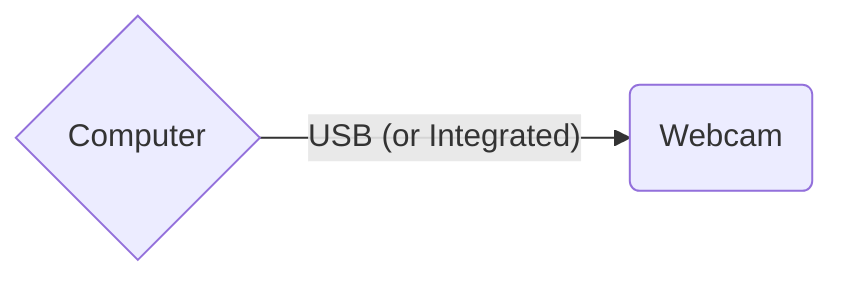
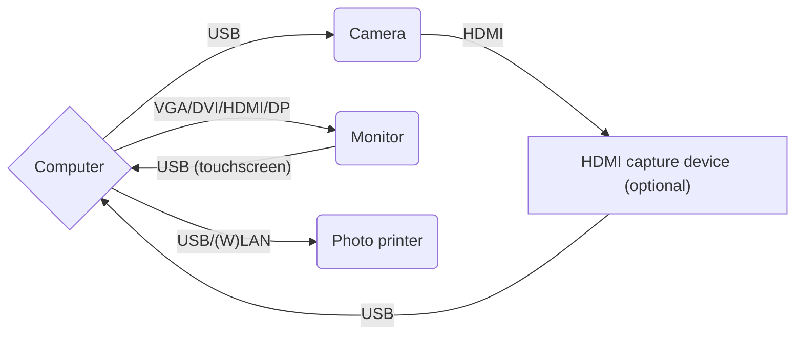

# Getting started

Getting started with MomentoBooth is easy! You only need a computer/laptop with a webcam for a minimal setup. Read more about our hardware recommendations and follow the install steps:

## Minimal hardware (mostly useful for testing/development)

A very basic (but useful for experimenting and developing) setup could consist of:

- A computer
  - OS either:
    - Windows 10/11
      - Windows 7/8/8.1 might work, but untested
    - Linux
      - Ubuntu 20.04 or newer, other recent distros should also be fine
    - macOS
      - Only tested on macOS 13 (Ventura), older versions might work but untested
  - CPU: Intel Core i5 (2nd gen) or equivalent
    - Older might work, but untested
  - GPU: Integrated or dedicated graphics by Intel/AMD/NVIDIA
    - Anything > 2010 should work fine, a little older may also work
    - Software rendering might work but untested
  - Memory: 4 GB
  - Disk: HDD with at least some space left for photo storage
  - Monitor: Anything
- Webcam



## Recommended hardware

- A computer
  - OS either:
    - Windows 10/11
    - Linux
      - Ubuntu 20.04 or newer, other recent distros should also be fine
    - macOS 13
  - CPU: Intel Core i3 (6th gen) or equivalent
  - GPU: Integrated or dedicated graphics by Intel/AMD/NVIDIA
  - Memory: 8 GB
  - Disk: SSD with enough space left for photo storage
  - Monitor: At least 1920x1080 with touch
- Digital camera
  - Live view: Supported directly by gPhoto2, or using HDMI out and a USB HDMI capture device (which can act like a webcam)
  - Capturing: Supported directly by gPhoto2
- Optional: Photo printer
- Optional: Internet connection



## Running the application

1. Download the latest MomentoBooth release for your OS from the [GitHub releases page](https://github.com/momentobooth/momentobooth/releases).
1. Extract the zip file and run the MomentoBooth executable.
    - It may be convenient to place a shortcut on your desktop.
1. You will be greeted by the homescreen saying "Touch to start" and a green background. Press `Ctrl+S` to open the settings panel. → [See all shortcuts](settings_general.md#hotkeys).
1. Go to the **hardware** tab
1. Ensure [live view method](settings_hardware.md#live-view-method) is set to "Webcam" and select your webcam from the list in the [webcam setting](settings_hardware.md#webcam). The [capture method](settings_hardware.md#capture-method) is set to "Live view source" by default.
    - If you do not have a webcam available you can also select "Static noise" as a live view source for testing.
1. Next, go to the **output** tab.
1. Set an [output directory](settings_output.md#local-photo-storage-location) to save your photos.
1. Next, go to the **templating** tab.
1. Set a [template directory](settings_templating.md#template-location) to look for template files.
1. Go to that directory in your file explorer and place a background (portrait) image called `back-template.jpg` or `back-template.png`.
1. You are now ready to shoot your first pictures! Press `Ctrl+S` again to exit the settings screen and click on or touch the screen to get started.

Once you have the basics up and running you can try [connecting a camera](camera_setup.md#camera), [adding a printer](printer_setup.md), or designing a beautiful [template](template_setup.md) for your next event.

## Current limitations

```admonish warning
While the application has been used a few times already at different kinds of events, it is still considered pre-release. Please read the list of limitations.
```

- Webcam support (and as such HDMI capturing) is not working on Linux and macOS currently.
  - As of 2024 Q3 there is are some bugs in the library that is used for this functionality, these will be resolved in future versions.
  - Due to this bug, HDMI capture also will not work. As such camera's which don't support live view over USB through gPhoto2 but do support live view using HDMI out (e.g. Nikon D3100) current will not work on Linux and macOS.
  - **Workaround**: Use a camera which supports live view using USB, or use Windows.
- macOS: No native builds for Apple Silicon available yet.
  - As cross compilation with native libraries is pretty challenging and GitHub not supporting Apple Silicon runners yet as of 2024 Q3, native Apple Silicon builds for macOS cannot be provided yet.
  - This will be fixed when Apple Silicon runners are made available by GitHub.
  - **Workaround**: Use the Intel/x86_64 builds for now. These should work on Apple Silicon machines without any performance or hardware compatibility issues.
- Live view through gPhoto2: Currently only Nikon D3400 and Sony α6400 have been tested.
  - As many Nikon cameras use the same commands for activating and deactivating live view, other Nikon DSLR models which support live view over USB may work.
  - Many mirrorless (non-DSLR) cameras may work fine anyway due to live view mode being activated automatically (e.g. Sony α6400).
  - The camera handling code is written with future special cases for different brands and models in mind, however we do not have any devices available for development and testing currently.
  - **Workaround**: Try the different options available in the settings screen. If these don't work, your help might needed to fix the issue if possible at all. Please let us know by [raising an issue on GitHub](https://github.com/momentobooth/momentobooth/issues/new). Be sure to first check whether your model is listed on the [gPhoto2 compatibility list](http://www.gphoto.org/proj/libgphoto2/support.php). We might be able to expand the compatibility of the application with some remote testing. No guarantees however.
