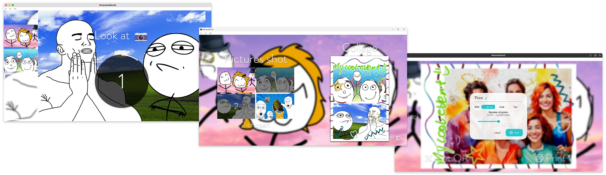

 
<picture>
  <source media="(prefers-color-scheme: dark)" srcset="imgs/MomentoBooth-combined-logo-dark.svg">
  <source media="(prefers-color-scheme: light)" srcset="imgs/MomentoBooth-combined-logo-light.svg">
  
</picture>

<h3 align="center">Cross-platform open source photo booth software. Capture your events in an easy and fun way!</h3>
 

*[Jump directly to installation steps](installation.md)*\
*[Jump directly to getting started guide](getting_started.md)*

## Features

* **Capture images and collages**
  * Single capture
  * Multi-capture
    * Fixed layout – 2, 3, or 4 photos
    * User chosen layout – shoot 4 photos and then select the ones you like to for a collage of 1, 2, 3, or 4 photos
  * Manual collage creation – process pictures after untethered handheld shooting
* **User friendly, touch-centered interface**
  * Beautiful animations
  * [Multi-language support](#translations)
  * Different UI themes available
* **Photo printing**
  * Lots of settings included to size and position your print well
  * Support for native printing method and dispatch to CUPS server
* **Photo sharing using QR code** with [`ffsend`](https://github.com/timvisee/ffsend)
* **Theming with collage template images** (background and foreground)
* **Rich live view and capture options**
  * Select device with 1 click or select custom options & combinations
  * *Webcam*
    * You can use HDMI capture dongles that act as a webcam
  * *Digital camera*
    * Use *any camera* over USB that [supports *live view* through libgphoto2](http://www.gphoto.org/proj/libgphoto2/support.php), *capture* also required for high quality captures
    * With Sony Imaging Edge Remote using AutoIt
  * Quick debug options for when no hardware is available
* **Gallery with created images**
  * Easily re-print or -share
  * (beta) Analyse images and
    * Order by # of people on picture
    * Find your image with face recognition
* **Keeps (local) use statistics** – how many photos were taken, prints were made, …
* **Easy administration**
  * Clear *settings panel*
  * Keep organised with *project directories*
  * Health checks of external IPs/HTTP services with clear warning banners
* **Cross platform**
  * Supported on Windows, Linux, and macOS
* **Low system requirements**
  * Can run comfortably, even on old hardware
* **Integrates with Home Assistant**
  * State communicated over MQTT
  * Easy automation – e.g. WLED lights that respond to countdown and capture

### Planned

* Improve distribution options
  * [ ] Linux Flatpak distribution (x86_64 and arm64)
  * [ ] Windows arm64 distribution
  * [ ] Up to date macOS builds (with correct signing)
* Maturing
  * [ ] Provide choices in exception sharing
  * [ ] List licenses of libraries
* Translate
  * … to more languages
  * … more parts of the app
* Test
  * More cameras – get in touch!
* New features
  * [ ] Backend/control API
    * [ ] Physical button control options
    * [ ] Voice/LLM control
    * [ ] Remote monitoring
  * [ ] Deep learning based background removal
  * [ ] Video capture support
  * [ ] Offer more control over collage layouts
  * [ ] Allow generating reports for easier support
  * [ ] More sharing options

## Development

For development setup instructions, see the [dev documentation](https://momentobooth.github.io/momentobooth/dev_setup.md).

## Translations

MomentoBooth [uses the awesome Weblate](https://hosted.weblate.org/engage/momentobooth-photobooth/) to manage translations. If you would like to add a new language or improve existing translations, please use Weblate to make suggestions — Weblate will automatically create a PR for you!

**Currently supported languages are**

| **Language** | **State** |
|---|---|
| 🇬🇧 English | ✅ Base language |
| 🇳🇱 Dutch | ✅ Fully checked |
| 🇫🇷 French | Mostly checked |
| 🇩🇪 German | ⚠️ Unchecked |

## Links
- [Download the latest release from GitHub](https://github.com/momentobooth/momentobooth/releases)
- Join our [Discord server](https://discord.gg/mCMEv2fHSN)!
